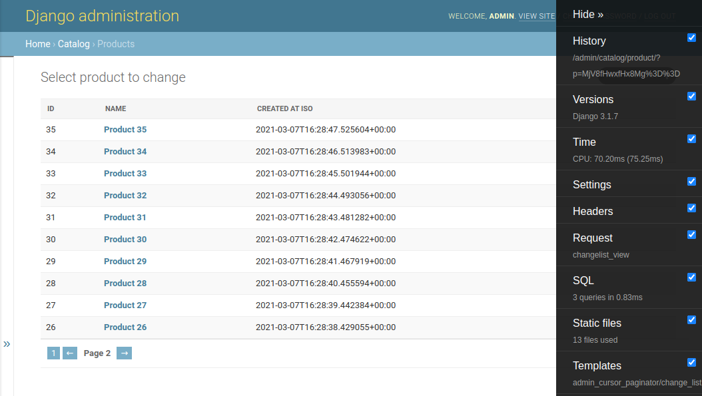

# django-admin-cursor-paginator

Drop-in replacement for django admin default pagination that works fast with huge tables.


## Prerequisites

- You are using django (>2.0) admin
- Some of your models/tables contains so much data that list page lags
- You don't want to make separate CRM page for them and just need fast and simple solution
- You're ok that you won't see total objects or pages count and will navigate only by +-1 page
- Index must be created for the ordering field, otherwise you won't get any significant speedup
  (default integer pks work perfectly out-of-box)
- Ordering field type can be almost anything that can be "encoded" via `str()`
  and then be used in `queryset.filter()`

> **NOTE**  
If ordering field is not unique then pagination can mess a bit in edge cases.
But for the most often case with datetime fields with milliseconds like `created_at` it won't be a problem.
It can be solved in future by adding support for multiple ordering fields.


## Installation

All you need is to install it via `pip` like that:

```shell
pip install django-admin-cursor-paginator
```

...and extend `INSTALLED_APPS` (it is needed only for templates):

```python
INSTALLED_APPS = [
    'django.contrib.admin',
    # ...
    'admin_cursor_paginator',
    # ...
]
```


## Usage example

So this app will certainly help you if you're using admin to see some (usually) last inserted entries
and may be also want to search for particular objects.

But anyways it's just a regular django admin page.

```python
from admin_cursor_paginator import CursorPaginatorAdmin

class YourModelAdmin(CursorPaginatorAdmin):
    cursor_ordering_field = '-created_at'  # default is '-pk'

class AnotherModelAdmin(CursorPaginatorAdmin):
    cursor_ordering_field = 'parent__sort'  # joins are supported as well
```


## The problem

Default django admin list view makes several queries to show data.
The first one is something like `select count(*) from app_model` to calculate pages range
and `select * from app_model limit 10 offset 1000` to fetch current page data.
Both of them start to produce performance problems as your table grows.

For example, with >1M entries in postgresql table `count(*)` took a few seconds (in our case) because of seq scan. 
Limit+offset also performs badly on far pages.


## The solution

The solution is to use cursor pagination instead of default one (you can find many standalone packages for it).
It doesn't need `count(*)` query at all and performs fast by using filter instead of limit+offset.

Some useful links:
- https://cra.mr/2011/03/08/building-cursors-for-the-disqus-api/
- https://www.django-rest-framework.org/api-guide/pagination/#cursorpagination
- https://hakibenita.com/optimizing-the-django-admin-paginator


## Test project

In `testproject` folder you can (surprisingly) find test project that uses this app
for one model so that you can see live example and check how it works if you want.

All you need is to install requirements from `requirements.txt` in some env,
run `./manage.py runserver`, login as admin:admin to django admin and open `Product` list.

Project includes sqlite3 file with some test data and preinstalled `debug_toolbar`
to observe db queries.

You can play with ordering field or data amount or may be test it in your target db.

Example of how pagination will look like:

